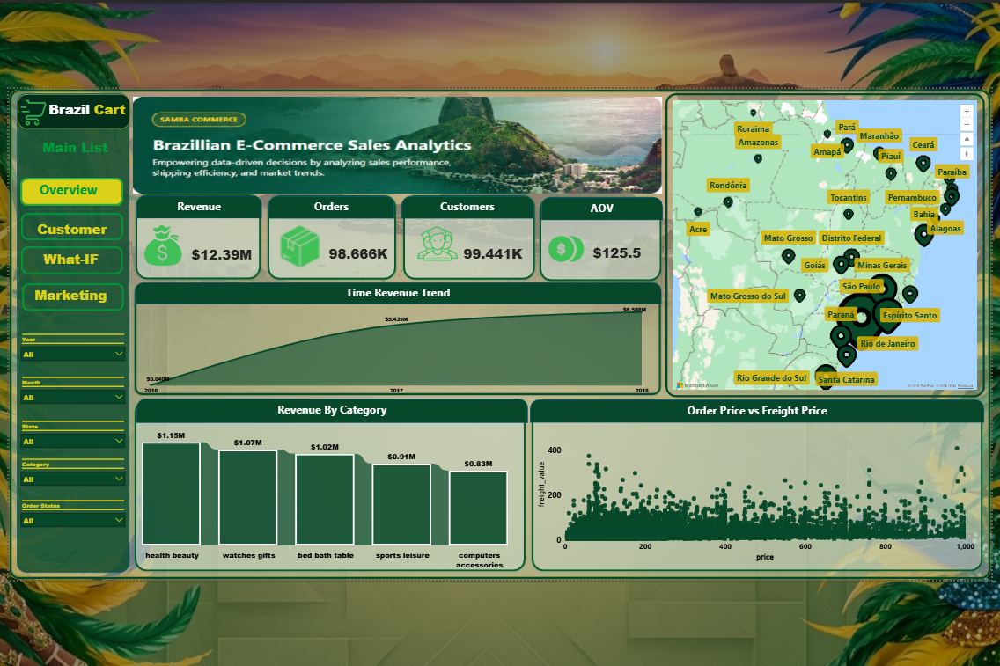
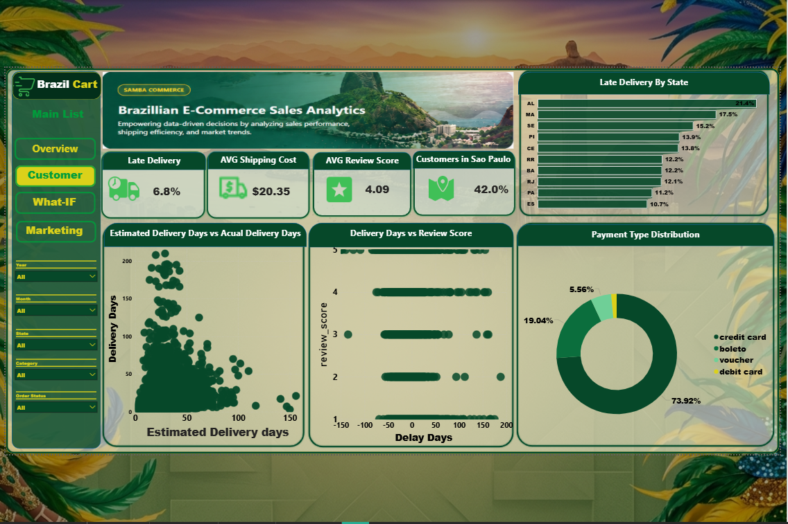
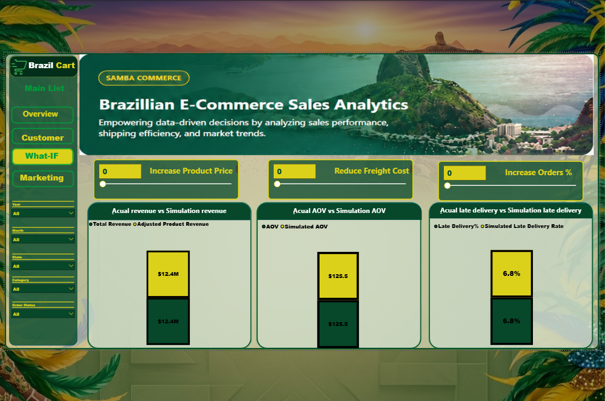
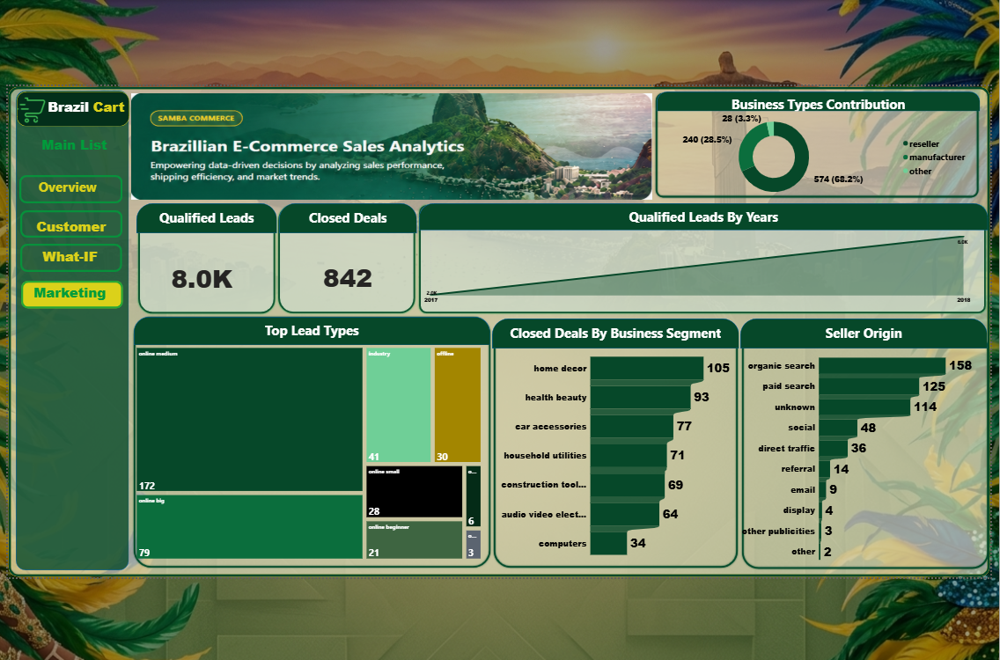

# 🇧🇷 Brazilian E-Commerce & Marketing Analytics Project

## 📑 Table of Contents
- [Overview](#-overview)
- [Business Problem](#-business-problem)
- [Project Architecture](#-project-architecture)
- [ETL Pipeline](#-etl-pipeline)
  - [Bronze Layer](#1-bronze-layer-raw-data)
  - [Silver Layer](#2-silver-layer-cleaned-data)
  - [Data Cleaning & Transformation](#3-data-cleaning--transformation)
  - [Data Quality Issues](#4-data-quality--shortage-handling)
  - [Aggregation Layer](#5-aggregation-layer)
- [Power BI Analysis](#-power-bi-analysis)
- [KPIs & DAX Measures](#-kpis--dax-measures)
- [What-If Analysis](#-what-if-analysis)
- [Dashboard Preview](#-dashboard-preview)
- [Key Insights](#-Key-Insights)
- [Technical Stack](#-technical-stack)
- [Key Learnings](#-key-learnings)
- [Future Improvements](#-future-improvements)
- [Author](#-author)

---

# 📌 Overview
This project demonstrates a complete End-to-End Data Analytics workflow for a Brazilian E-Commerce & Marketing dataset using SQL Server and Power BI.

The project focuses on building a modern Data Warehouse architecture with ETL processes, data cleaning, aggregation layers, KPI development, and interactive dashboards.

The workflow transforms raw business data into analytics-ready datasets and business insights that support operational and strategic decision-making.

---

# 🎯 Business Problem
The raw dataset contained several real-world data quality issues including:
- Missing values
- Incorrect data types
- Duplicate records
- Inconsistent categorical values
- Missing product categories and prices
- Orders existing without corresponding parent order records

These issues affected reporting accuracy, revenue calculations, logistics analysis, and customer insights.

The goal of this project was to:
- Build a scalable ETL pipeline
- Clean and standardize the data
- Improve analytical accuracy
- Create optimized aggregation layers
- Deliver actionable business insights using Power BI

---

# 🏗️ Project Architecture

```text
Kaggle Dataset
      ↓
Bronze Layer (Raw Data)
      ↓
Silver Layer (Cleaned & Standardized Data)
      ↓
Aggregation Views
      ↓
Power BI Data Model
      ↓
KPIs & Dashboards
```

---

# 🔄 ETL Pipeline

---

# 1. Bronze Layer (Raw Data)

## Purpose
The Bronze Layer stores raw source data exactly as received from Kaggle without any modifications.

## Process
- Imported raw CSV datasets into SQL Server
- Created Bronze schema
- Preserved original structure and values
- No transformations applied

## Goal
Maintain:
- Data traceability
- Source recovery
- Historical raw reference

---

# 2. Silver Layer (Cleaned Data)

## Purpose
The Silver Layer prepares analytics-ready data through:
- Cleaning
- Standardization
- Data quality fixes
- Business rule transformations

---

# 3. Data Cleaning & Transformation

## 🔹 Data Type Optimization
- Converted columns into proper SQL data types
- Fixed inconsistent formats

---

## 🔹 Handling Missing Values

### Numeric Null Handling
Implemented Median Imputation strategy:

- Filled missing product prices using category median price
- Used Global Median Price when category was unavailable

### Categorical Null Handling
- Replaced missing categorical values using Mode
- Replaced blank values with `"Unknown"`

---

## 🔹 Data Standardization

Applied multiple standardization techniques:

- Trimmed spaces using `TRIM`
- Converted text to lowercase
- Standardized categorical values

### Removed Special Characters
Removed symbols such as:
- `%`
- `_`
- `-`
- `/`
- `\`
- `#`

---

## 🔹 Data Quality Fixes

### Shifted Columns Correction
Corrected rows where values shifted into incorrect columns.

### Duplicate Removal
Removed duplicated records to ensure data integrity.

---

## 🔹 Freight Value Transformation

### Problem
Freight value existed repeatedly inside `OrderItems` table which caused duplicated shipping calculations.

### Solution
- Extracted freight value into `Orders` table
- Calculated freight once per order instead of once per item

This improved:
- Revenue accuracy
- Shipping KPI accuracy
- Aggregation reliability

---

# 4. Data Quality & Shortage Handling

## Orders Existing Without Parent Order Record

### Problem
Some records existed in `OrderItems` table but were missing from `Orders` table.

### Impact
Missing:
- Purchase date
- Delivery date
- Shipping approval date

### Decision
- Preserved records instead of deleting them
- Added documentation note regarding incomplete tracking information

---

## Products Without Category & Price

### Problem
Some products had:
- Missing category
- Null prices

### Solution
Applied Global Median Price fallback.

---

# 5. Aggregation Layer

To improve Power BI performance and simplify dashboard loading, multiple SQL aggregation views were created.

---

# 📊 Aggregation Views Created

## 📈 Time Analysis
- Orders Count Trend
- Revenue Trend Over Time

## 🛒 Product Analysis
- Top Categories by Revenue

## 🌍 Geographic Analysis
- Revenue by State
- Customer Distribution by State
- Orders & Revenue by City

## 💳 Payment Analysis
- Payment Orders Count
- Payment Values Analysis

---

# 📊 Power BI Analysis

An interactive Power BI dashboard was built to analyze:
- Sales performance
- Customer behavior
- Logistics efficiency
- Payment performance
- Geographic trends
- Marketing performance

---

# 📌 KPIs & DAX Measures

## Sales KPIs
- Total Revenue
- Total Orders
- Average Order Value (AOV)

## Customer KPIs
- Total Customers
- Average Review Score (ARS)
- Customer Distribution

## Logistics KPIs
- Average Shipping Cost
- Late Delivery %
- On-Time Delivery %

## Marketing KPIs
- Qualified Leads
- Closed Deals

---

# 🎯 What-If Analysis

Implemented interactive What-If simulations using DAX.

## Scenarios Included
- Freight Cost Reduction Impact
- Product Price Increase Impact
- Order Growth Simulation
- Simulated AOV
- Simulated Late Delivery Rate

These simulations help analyze how operational decisions affect:
- Revenue
- Order volume
- Delivery performance
- Customer experience

---

# 📸 Dashboard Preview

## 📊 1. Executive Overview



---

## 🌍 2. Customers Behavioral & Market Analysis



---

## 🚚 3. What-IF Analysis



---

## 👥 4. Marketing Insights



---

# 📊 Key Insights

## 📈 Revenue & Orders Performance

- Revenue peaked in **2018**, followed by **2017** and **2016** respectively.

- 2018 achieved the highest order volume with approximately **52.8K orders** and the largest customer count.

- Despite higher order volume in 2018, **2017 generated a slightly higher Average Order Value (AOV)**, while **2016 recorded the highest AOV overall**.

- This indicates that recent growth is driven more by order volume than by customer spending value.

---

## 🛒 Product & Category Performance

- The **Health & Beauty** category generated the highest revenue at approximately **$1.15M**.

- The weakest category was **Security & Services**, contributing only around **$283** in total revenue.

---

## 🌍 Geographic Performance

- **São Paulo (SP)** is the top-performing state with approximately **$4.7M revenue**.

- **Roraima** recorded the lowest revenue at around **$7.1K**.

- Customer concentration in São Paulo increased by approximately **5% compared to the previous year**, reinforcing its dominance as the primary market.

---

## 🚚 Logistics & Delivery Performance

- The average late delivery rate is approximately **6.8%**.

- **2018 recorded the highest late delivery rate at 7.7%**, increasing by approximately **2.1% YoY**.

- However, this increase occurred alongside strong business growth, with order volume increasing by approximately **9.4K additional orders**.

- States show significant differences in delivery performance:
  - **Alagoas** recorded the highest late delivery rate at **21.4%**
  - **Amazonas** achieved the best logistics performance with only **2.8% late deliveries**

---

## ⭐ Customer Satisfaction & Reviews

- Customer review scores remained relatively stable compared to the previous year.

- Delivery delay has a direct impact on customer satisfaction:
  - Orders with the highest delay days were heavily associated with **1-star reviews**
  - Orders delivered earlier or close to the estimated date were strongly associated with **5-star reviews**

- This highlights logistics performance as a major driver of customer experience and satisfaction.

---

## 💳 Payment Behavior

- **Credit Card** is the dominant payment method, contributing approximately **73.9%** of all transactions.

- **Debit Card** usage is extremely low at only **1.5%**, making it the least utilized payment method.

---

# 📢 Marketing Insights

## 📌 Business Types

- The majority of sellers belong to the **Reseller** business type, contributing approximately **68.2%** of total leads.

---

## 📈 Lead Growth

- Qualified Leads (MQLs) increased dramatically by approximately **4K leads**, representing nearly **3x growth compared to the previous year**.

- This indicates strong growth in marketing acquisition efforts.

---

## 🔍 Lead Acquisition Channels

### Best Performing Channels
The most effective channels for seller acquisition are:
- Organic Search
- Paid Search

These channels generated the highest lead contribution and engagement.

### Weakest Channels
The least effective acquisition channels were:
- Display Ads
- Email Marketing
- Referral
- Other Publicities

---

## 🏪 Business Segments

- **Home Decor** is the top-performing business segment.

- **Computers** is the weakest-performing segment in terms of leads and business activity.

---

## 🌐 Lead Types

- The top-performing lead type is **Online Medium**.

- The weakest lead type is **Online Top**.
  


---

# 🛠️ Technical Stack

| Tool | Purpose |
|---|---|
| SQL Server | Data Warehouse & ETL |
| T-SQL | Data Cleaning & Transformation |
| Power BI | Visualization & Dashboards |
| DAX | KPI Development |
| Kaggle Dataset | Data Source |

---

# 🚀 Key Learnings

Through this project I gained hands-on experience in:

- ETL Pipeline Development
- Data Warehouse Architecture
- SQL Data Cleaning
- Data Standardization
- Aggregation Optimization
- Power BI Data Modeling
- DAX KPI Development
- Business Performance Analysis

---

# 📎 Future Improvements

Future enhancements may include:
- Adding Gold Layer
- Automating ETL pipelines
- Incremental Refresh
- Forecasting models
- Cohort Analysis
- Power BI Service Deployment

---

# 👤 Author

**Saeed Mohamed**  
Data Analyst | SQL | Power BI | ETL | Data Warehousing
